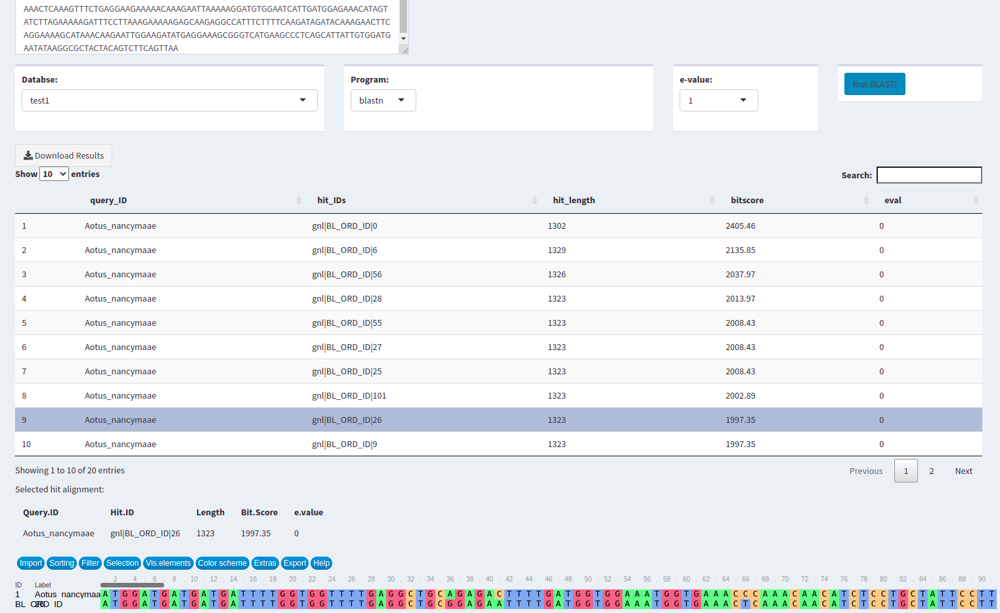

## This is merely an adaptation of Jake Warner's Shiny_BLAST: https://github.com/ScientistJake/Shiny_BLAST

* Added a way to upload sequences to create a new blast database
* Added alignment visualisation with msaR
* Added a download button to save blast results 
* A Dockerfile can be used to deploy the app inside a container

 
# Howto install :

## clone the repository: if you d'ont have a copy of the app

git clone https://github.com/BELKHIR/shiny-blast.git

cd shiny_blast

## Directories to share between your file system and the container

All your query files must reside on a directory that will be mounted in a directory named /Data inside the container  
e.g. /home/$USER/fastaFiles that will be maped to /Data

All results files will be in a dir named /Results inside the container
Create a directory that will be maped to /Results 
e.g. /home/$USER/blastResults

## create a folder for blast dbs :
mkdir /home/$USER/blastResults/db

## build the docker image
sudo docker build  -t local_shiny_blast .

## run the image
sudo docker run --rm -it --name local_shiny_blast_container -p 9090:3838 -v /home/$USER/fastaFiles:/Data -v /home/$USER/blastResults:/Results local_shiny_blast 

## open the web app
 
The shinyBlast application can be launched via a navigator in http://127.0.0.1:9090

First you have to create a DB via the "New Database" page !
